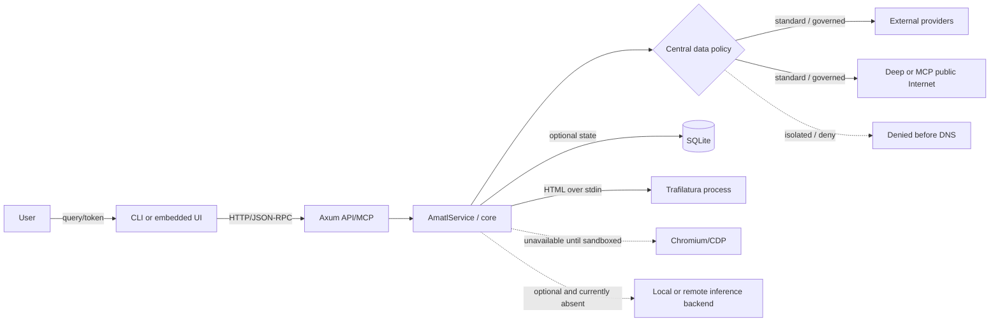

# AMATL threat model

Status: baseline `51c6d34`, verified against the current tree on 2026-08-13.
Method: STRIDE per trust boundary. This model describes implemented
controls; a missing control is residual risk, not an implied capability.

## Assets and security objectives

Assets are provider credentials, the server bearer token, user queries,
retrieved documents, provider/cache telemetry, local SQLite data, host network
reachability, compute/memory/bandwidth budgets, and the integrity of result
ranking. The objectives are confidentiality of secrets, integrity and provenance
of results, bounded availability, and prevention of access to non-public network
resources.

## Data flow and trust boundaries

Each arrow crosses a trust boundary. CLI input is untrusted. The browser and
HTTP client are untrusted callers. Provider responses and all Internet content
are hostile. SQLite is local but corruptible. Trafilatura is an external
process. Chromium is not trusted enough to activate.

There is currently no inference backend or LLM dependency. The data policy
models `disabled`, `local_only`, and `remote_explicit` so a future optional
backend must obtain explicit permission. `isolated` can allow local inference
but never remote inference.

## STRIDE analysis by boundary

| Boundary | STRIDE | Threat | Implemented control | Evidence | Residual risk |
|---|---|---|---|---|---|
| User → CLI/UI | S/T | Forged or malformed query alters intended filters | Query grammar and contradictions are parsed centrally; API/MCP reject empty or >2048-byte queries | `query.rs:16-216`; `amatl-server/src/lib.rs:397-399`; `query.rs:222-250` | Unicode confusables and semantic abuse remain possible; client-side validation is not a control |
| User → CLI/UI | R/I | Query or token leaks through terminal history, UI state, or logs | Token is read from an environment variable; UI keeps it in page memory; structured routing logs omit query and token | `amatl-cli/src/main.rs:240-260`; `amatl-ui/assets/app.js`; `execution.rs:348-366` | Shell history/process environment and browser memory are operator-controlled; no secret scanner at runtime |
| UI → API/MCP | S/E | Caller impersonates an authorized local client | Protected routes require a bearer token of at least 32 bytes; constant-time comparison; `no_auth` is loopback-only | `amatl-server/src/lib.rs:93-108,348-427`; `config.rs:616-650`; `amatl-server/src/tests.rs:49-76`; `config.rs:743-754` | Shared bearer has no per-user identity, scopes, expiry, or revocation list |
| UI → API/MCP | T/I | Host, Origin, CORS, framing, or content-type abuse | Exact Host/Origin lists, restrictive CORS, CSP, `nosniff`, no inline/eval, frame denial | `amatl-server/src/lib.rs:336-451,506-515`; `amatl-ui/src/lib.rs:7-53`; `amatl-server/src/tests.rs:31-151`; `amatl-ui/src/lib.rs:79-106` | Reverse-proxy trust and request-smuggling behavior are not integration-tested |
| UI → API/MCP | D | Oversized, slow, concurrent, or automated requests exhaust service | 64 KiB body, 16 KiB headers, 30 s request/idle timeouts, 64 connections, 60 requests/minute keyed by socket IP before authentication | `config.rs`; `amatl-server/src/lib.rs`; `amatl-server/src/tests.rs` | In-memory rate windows are per process and not proxy-aware; many source IPs can distribute load |
| Core → outbound network | I/E | A provider, Deep, MCP fetch, canary, or future inference path leaks exercise data | Central `data_policy`; isolated profile requires denied egress and loopback, rejects remote inference/providers/renderer, installs denied fetcher/transport, and emits value-free `egress_denied` | `config.rs`; `service.rs`; `amatl-server/src/mcp.rs`; config/service/MCP tests | Application policy is not an OS firewall; external extractors and a cloud MCP client are outside its process boundary |
| Core → providers | S/T | Provider endpoint or response is spoofed/poisoned | rustls certificate validation; provider-specific parsers; normalization, canonicalization, conservative dedupe, provenance, deterministic ranking/diversity | `Cargo.toml`; `providers/brave.rs`; `providers/mojeek.rs`; `normalize.rs`; `canonical.rs`; `dedupe.rs`; `ranking.rs`; `tests/providers_phase1.rs`; `tests/result_pipeline_phase2.rs` | No cryptographic authenticity for search results; malicious but valid text/URLs may rank highly |
| Core → providers | R/I | Secrets leak in URL, error, or log | Credentials come from configured environment variables; provider errors are generic; sensitive query keys have a redaction view | `service.rs:384-390`; `providers/http.rs:12-29,64-101`; `providers/http.rs:109-119`; `providers/mojeek.rs:390-408` | `sanitized_url()` is tested but no centralized logging wrapper enforces its use for future adapters |
| Core → providers | D | Provider latency, retries, quota, or large response drains resources | Provider/global deadlines, bounded concurrency, maximum two retries, jitter, no redirects, 2 MiB response cap, global provider-call Budget | `config.rs:354-379,522-532`; `service.rs:123-164,325-326`; `providers/http.rs:49-96`; `budget.rs:165-204`; `execution.rs:44-155` | Retry policy can amplify provider traffic; no distributed quota coordination between processes |
| Deep → Internet | S/E | SSRF or DNS rebinding reaches loopback, private, link-local, internal names, or alternate schemes | URL checked before DNS, entire DNS answer validated, addresses pinned to connection, redirects disabled in client and revalidated each hop | `security.rs:4-76`; `fetch.rs:96-143,161-218,251-260`; `security.rs:83-116`; `fetch.rs:301-333` | Public IPs that route internally through operator infrastructure cannot be classified by application logic; no domain allowlist |
| Deep → Internet | T | Malicious `Location` changes scheme/host or injects credentials | Relative locations are structurally joined, schemes/credentials/host are validated, then DNS is resolved and validated again | `fetch.rs:122-130,255-260,102-120`; `fetch.rs:326-333` | Redirect tests cover private literal targets, not a live DNS rebinding server |
| Deep → Internet | D | Oversized content, redirect loops, crawl explosion, or expensive subqueries | DeepBudget accounts fetches, bytes, redirects, browser calls, crawl URLs, subqueries, cost, and deadline; depth ≤2 | `budget.rs:29-156`; `config.rs:582-615`; `service.rs:209-267`; `budget.rs:219-245`; `tests/deep_phase5.rs:221-269` | Memory/CPU used while parsing within accepted byte limits is not separately metered |
| Core → Trafilatura | T/E | Hostile HTML exploits or controls extractor process | Exact executable and fixed arguments; HTML only through stdin; stdout byte cap, timeout, kill-on-drop, stderr discarded; failure is typed and optional | `extract.rs:43-150`; `extract.rs:173-185`; `tests/deep_phase5.rs:271-285` | No OS sandbox, seccomp, uid separation, network denial, or pinned executable hash; external process compromise remains possible |
| Core → Chromium | E/D | Remote JavaScript escapes browser or consumes resources | Fail-closed capability: renderer always unavailable even if configured until CDP isolation and limits are implemented | `render.rs:33-67`; `render.rs:74-88` | Rendering functionality is absent; future activation requires a new threat-model review and security tests |
| Core → SQLite | T/I/D | Corruption, contention, or cache poisoning changes correctness | SQLite is optional; failures degrade; WAL, NORMAL sync, 5 s busy/acquire timeout, pool 4, header/quick-check quarantine, versioned keys and TTL/LRU quotas | `service.rs:101-112`; `storage.rs:58-118`; `cache.rs:39-99`; `document_cache.rs:24-85`; `storage.rs:581-670` | Database is not encrypted or authenticated; local users with file access can read or modify it |
| MCP → Deep/Internet | E/D | MCP becomes a general network proxy | MCP route requires bearer token/rate limit; exactly four tools; MCP search/Deep budgets are stricter; fetch routes through the service policy and, when governed, uses the same SafeFetcher with 3 s/256 KiB/two redirects | `service.rs`; `amatl-server/src/mcp.rs`; `amatl-server/src/tests.rs` | Under `standard`, authorized clients can use fetch as a bounded public-network proxy; `isolated` denies it, but cannot prove the MCP client itself is local |
| All → logs/errors | I/R | Secrets or attacker-controlled text leaks or forges logs | HTTP errors expose fixed codes; provider transport errors are generic; non-TTY logs are structured JSON | `amatl-server/src/lib.rs:517-535`; `providers/http.rs:64-101`; `amatl-cli/src/main.rs:19-98` | There is no automated end-to-end secret-redaction test or durable audit log; debug data governance is operator responsibility |

## Accepted risks and review triggers

- The shared bearer token is suitable for local/small trusted deployments, not
  multi-tenant authorization.
- SQLite confidentiality depends on host filesystem controls.
- Provider result integrity is heuristic, not cryptographic.
- Under `standard`, authorized MCP `fetch` is a bounded public-web proxy by
  design; `isolated` disables it.
- Trafilatura lacks OS-level isolation.
- Chromium is excluded from the active capability surface.
- `isolated` is an application fail-closed control, not proof of host-wide
  containment; confidential deployments also require a local client/inference
  runtime and an OS/network sandbox.

Review this model before enabling Chromium, adding a provider or outbound
protocol or inference backend, changing authentication, trusting proxy headers,
storing document content by default, or changing any Budget/HTTP limit.

References: [OWASP ASVS 5.0.0](https://github.com/OWASP/ASVS/tree/v5.0.0/5.0),
[OWASP Top 10 A04:2021 Insecure Design](https://owasp.org/Top10/A04_2021-Insecure_Design/),
and [OWASP SAMM](https://owaspsamm.org/).
